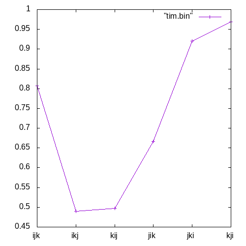

Основная программа, умножающая матрицы sspp.cpp.
В файле gen.cpp программа, которая генерирует 2 квадратные матрицы, заполняет их случайными числами и записывает в файлы "a.bin", "b.bin". Так же создает контрольную матрицу по ijk и записывает в файл "cntrl.bin" и создает файлы "out.bin", "tmp.bin", "tim.bin".
В cntrl.cpp программа, проверяющая матрицы на идентичность, используется для сравнения результата основной программы и проверочной матрицы в файле "cntrl.cpp".
tim.cpp вспомогательная программа для подсчета времени и вывода результата в файл для работы gnuplot.

